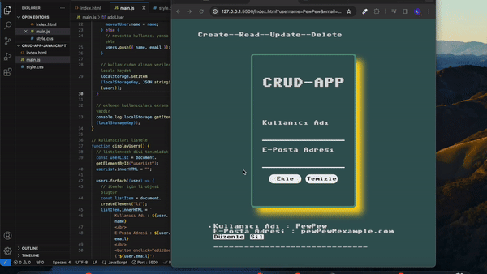

# JavaScript CRUD Application

This JavaScript application is a simple CRUD (Create, Read, Update, Delete) functionality that utilizes Local Storage for data persistence.

## Usage

- Open `index.html` in a web browser to launch the application.
- You can add new items, update existing ones, and delete them as well.

## Technologies

- HTML
- CSS
- JavaScript
 
 

